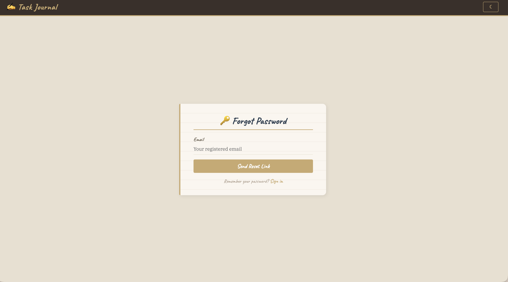
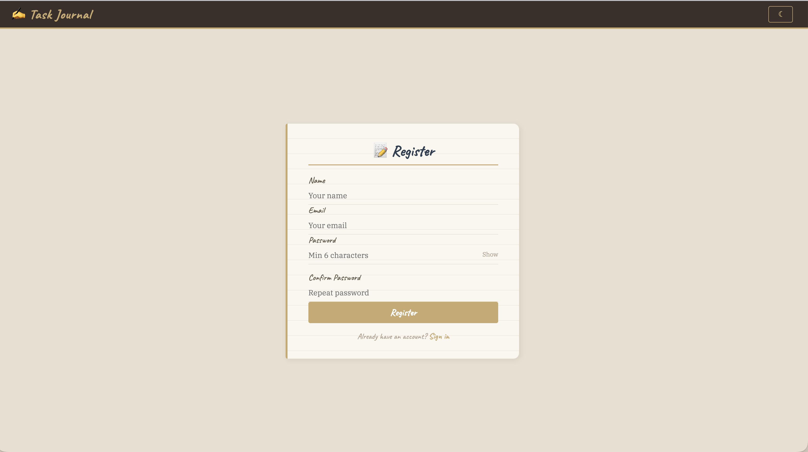
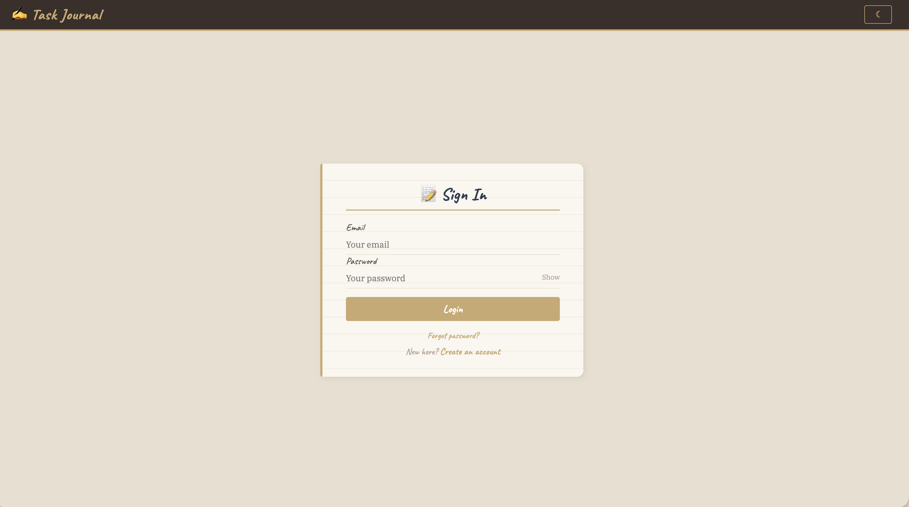
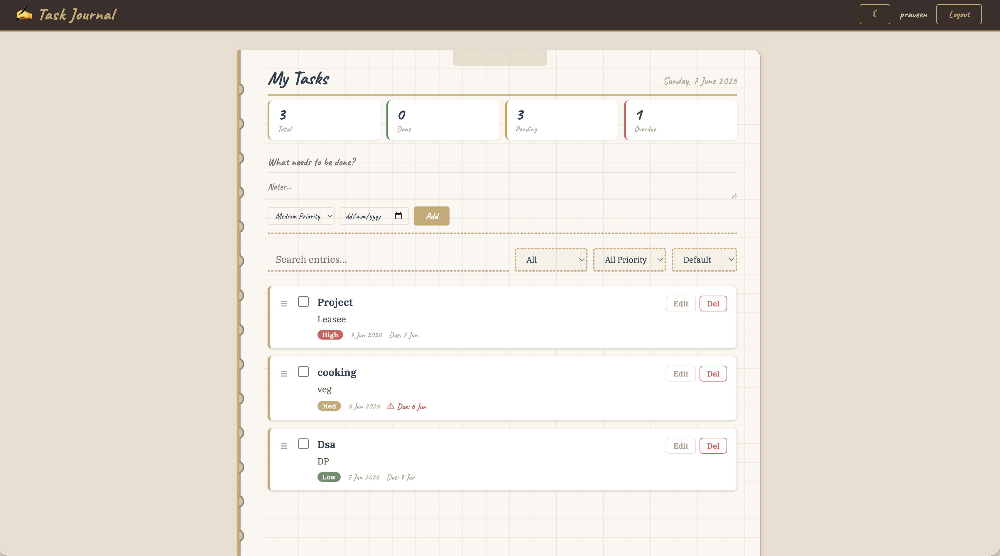

# Task Manager - MERN Stack

A full-stack task management application built with MongoDB, Express.js, React.js, and Node.js.  
Deployed at **[https://task-manager-praveenkg.vercel.app](https://task-manager-praveenkg.vercel.app)**

---

## Features

### Authentication
- User registration & login with JWT
- Password strength indicator with confirm password
- Show/hide password toggle
- Token-based password reset via email (crypto.randomBytes)
- Email verification on registration
- Helmet + rate limiting (100 req/15min on /api/auth)

### Task Management
- Create, edit, delete, and view tasks
- Toggle tasks between pending/completed
- Priority levels (low, medium, high) with color-coded badges
- Due date picker with overdue indicators
- Search by title or description
- Filter by status (all / pending / completed) and priority
- Sort by due date, priority, or creation date
- Pagination (8 tasks per page)
- Drag-and-drop reordering

### UI/UX
- Notebook/journal aesthetic with ruled paper, spiral rings, warm tones
- Dark / light mode toggle (persisted to localStorage)
- Toast notifications for all actions
- Fully responsive (mobile + desktop)

### Security
- JWT-based protected routes
- bcrypt password hashing
- Input validation (client + server side with express-validator)
- XSS protection via helmet
- Rate limiting on auth routes

---

## Live Demo

| Layer | URL |
|---|---|
| **Frontend** | https://task-manager-praveenkg.vercel.app |
| **Backend API** | https://task-manager-api-emuh.onrender.com |
| **Health Check** | https://task-manager-api-emuh.onrender.com/api/health |

---

## Screenshots

| | |
|---|---|
| **Login** | **Register** |
|  |  |
| **Dashboard** | **Task Form** |
|  |  |

---

## Prerequisites

- Node.js >= 18
- MongoDB Atlas account (or local MongoDB on port 27017)

---

## Local Setup

### 1. Clone

```bash
git clone https://github.com/Praveenkg02/Task-manager.git
cd task-manager
```

### 2. Backend

```bash
cd backend
npm install
cp .env.example .env   # fill in your environment variables
npm run dev
```

Server starts on http://localhost:5001 (or PORT from .env)

### 3. Frontend

```bash
cd frontend
npm install
npm start
```

App opens at http://localhost:3000

---

## Environment Variables (backend/.env)

| Variable | Description |
|---|---|
| `NODE_ENV` | `development` or `production` |
| `PORT` | Backend port (default 5000) |
| `MONGO_URI` | MongoDB connection string |
| `JWT_SECRET` | Secret key for signing JWT tokens |
| `JWT_EXPIRE` | Token expiry (e.g. `7d`) |
| `SMTP_HOST` | SMTP host (e.g. `smtp.gmail.com`) |
| `SMTP_PORT` | SMTP port (e.g. `587`) |
| `SMTP_USER` | SMTP email address |
| `SMTP_PASS` | SMTP app password |
| `CLIENT_URL` | Frontend URL for reset/verify links |
| `CORS_ORIGIN` | Comma-separated allowed origins |

---

## API Endpoints

### Auth (`/api/auth`)

| Method | Endpoint | Description | Auth |
|---|---|---|---|
| POST | `/register` | Register a new user | No |
| POST | `/login` | Login & get JWT token | No |
| GET | `/me` | Get current user profile | Yes |
| GET | `/profile` | Get current user profile | Yes |
| POST | `/forgot-password` | Send password reset email | No |
| PUT | `/reset-password/:token` | Reset password with token | No |
| GET | `/verify-email/:token` | Verify email address | No |

### Tasks (`/api/tasks`)

| Method | Endpoint | Description | Auth |
|---|---|---|---|
| GET | `/` | List tasks (paginated, search, filter, sort) | Yes |
| POST | `/` | Create a task | Yes |
| PUT | `/`:id | Update a task | Yes |
| DELETE | `/`:id | Delete a task | Yes |
| PATCH | `/:id/toggle` | Toggle task status | Yes |
| POST | `/reorder` | Reorder tasks (bulk update positions) | Yes |
| GET | `/stats` | Get task statistics (total, pending, completed) | Yes |

---

## Tech Stack

- **Frontend:** React 18, React Router 6, Axios, Context API
- **Backend:** Node.js, Express.js, Mongoose, JWT, bcryptjs
- **Database:** MongoDB Atlas
- **Security:** helmet, express-rate-limit, express-validator
- **Email:** Nodemailer (Gmail SMTP + App Password)
- **Deployment:** Render (backend) + Vercel (frontend)

---

## Assignment Requirements Checklist

| Requirement | Status |
|---|---|
| User registration & login | ✅ |
| Create, update, delete, view tasks | ✅ |
| Mark tasks completed/pending | ✅ |
| Responsive UI with functional components & hooks | ✅ |
| Pages: Login, Register, Dashboard | ✅ |
| Form validation & API integration | ✅ |
| RESTful APIs | ✅ |
| JWT authentication | ✅ |
| Protected routes (middleware) | ✅ |
| User Schema (name, email, password) | ✅ |
| Task Schema (title, description, status, userId) | ✅ |
| GitHub repo link | ✅ |
| README with setup instructions | ✅ |
| **Bonus: Search & filter** | ✅ |
| **Bonus: Pagination** | ✅ |
| **Bonus: Deployment** | ✅ |

---

## License

MIT
